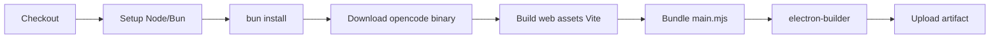

# OpenChamber Bundled Fork

基于 [openchamber/openchamber](https://github.com/openchamber/openchamber) v1.13.2 的 fork。

## 与上游的差异

### 架构改动

| 改动 | 上游 | 本 fork |
|------|------|---------|
| opencode 集成方式 | spawn 外部 `opencode serve` 子进程 | 构建时下载 binary，bundled 在 Electron extraResources 中 |
| opencode 生命周期管理 | PATH 搜索 → shell 探测 → wrapper 检测 → spawn → 健康检查轮询 → lsof 清理 | 直接 spawn 已知路径的 bundled binary，启动后做一次 readiness check |
| 子进程健康监控 | 15 秒间隔 + 20 次连续失败阈值 + busy session 保护 | 无（bundled binary 启动后不做周期性健康检查） |
| UI 加载方式 | `openchamber-ui://` 自定义协议（packaged 模式） | 始终走 HTTP（`http://127.0.0.1:PORT`） |
| 密码管理 | `ensureLocalOpenCodeServerPassword` 已存在 | 沿用，修复了 lifecycle 不同步的问题 |

### Linux 适配

| 功能 | 状态 |
|------|------|
| 窗口最小化/最大化/关闭按钮 | frameless + 自定义按钮，同 Windows |
| "打开方式"应用自动扫描 | `/usr/share/applications/.desktop` + `$PATH` 检测 |
| 打开项目/文件 | CLI 工具 + `xdg-open` |
| 应用图标 | 读取 `.desktop` 文件的 `Icon=`，搜索 hicolor 主题 |
| RPM 构建 | linux target（rpm + tar.gz） |
| autoUpdater | 禁用（fork 无对应 GitHub release） |

### 删除/简化的模块

| 文件 | 上游行数 | 本 fork 行数 | 说明 |
|------|---------|-------------|------|
| `lifecycle.js` | 946 | ~200 | 去掉 PATH 搜索、shell 探测、wrapper 检测、健康检查、lsof 清理 |
| `env-runtime.js` | 1088 | ~60 | 去掉 shell 快照、WSL 检测、node/bun 二进制查找、shebang 读取，只留 git 解析 |
| `shutdown-runtime.js` | 147 | ~80 | 去掉 `killProcessOnPort`、`waitForPortRelease` |

### UI 本地化

| 改动 | 说明 |
|------|------|
| `WorkingPlaceholder.tsx` | 新增 `STATUS_TRANSLATIONS_ZH` 映射表，35 条 assistant streaming 状态文字支持中文。当浏览器语言以 `zh` 开头时显示中文状态（思考中、读取文件、执行命令等），否则保持英文。通过 `navigator.language` 检测，不走 i18n 系统。 |

### Bug 修复

| 问题 | 根因 | 修复 |
|------|------|------|
| 首次打开提示配置 OpenCode | `bootstrapOpenCodeAtStartup()` 是 `void` 异步，UI 加载时 opencode 未就绪 | 改为 `await`，等 opencode 启动完成后再服务 UI |
| Health check 因密码不匹配失败 401 | lifecycle 生成密码后未同步到 auth state | 调 `ensureLocalOpenCodeServerPassword()` 同步 |
| KIO 无法读取 `openchamber-ui://app/` | 自定义协议处理在 KDE Wayland 下失效 | 禁用自定义协议，始终走 HTTP |

### 新增文件

- `scripts/download-opencode-binary.mjs` — 构建时从 GitHub releases 下载 opencode CLI
- `.github/workflows/build-linux.yml` — Linux 手动构建（支持 rpm/deb 选择）
- `.github/workflows/build-windows.yml` — Windows 手动构建
- `.github/workflows/build-macos.yml` — macOS 手动构建
- `FORK.md` — 本文件

### 删除的文件

- `.github/workflows/` 中的 11 个上游 workflows — 全部删除，替换为上述 3 个手动触发的工作流

## GitHub Actions 工作流

所有构建均为手动触发（`workflow_dispatch`），构建产物上传为 Actions Artifact。

### build-linux.yml

| 参数 | 说明 | 默认值 |
|------|------|--------|
| `package_format` | rpm 或 deb | rpm |
| `opencode_version` | opencode CLI 版本号（如 v1.17.10）或 latest | latest |

运行环境：`ubuntu-latest`。安装 ruby + fpm 用于 RPM 打包。

### build-windows.yml

| 参数 | 说明 | 默认值 |
|------|------|--------|
| `arch` | x64 或 arm64 | x64 |
| `opencode_version` | opencode CLI 版本号或 latest | latest |

运行环境：`windows-latest`。

### build-macos.yml

| 参数 | 说明 | 默认值 |
|------|------|--------|
| `arch` | x64 或 arm64 | arm64 |
| `opencode_version` | opencode CLI 版本号或 latest | latest |

运行环境：`macos-latest`（arm64）或 `macos-13`（x64）。

### 构建流程

所有三个工作流执行相同的步骤序列：



## 同步策略

上游更新时不要直接 `git merge`，用 cherry-pick。

```bash
git remote add upstream https://github.com/openchamber/openchamber.git
git fetch upstream
git log --oneline base..upstream/main   # 查看上游新 commit
git cherry-pick -x <commit-hash>        # 选择性拿
```

容易 cherry-pick 的文件：`packages/ui/src/`、`packages/web/server/lib/`（非 opencode/ 目录）、`packages/electron/preload.mjs`、`packages/vscode/`。

需要手动移植的文件：`lifecycle.js`、`env-runtime.js`、`shutdown-runtime.js`（和上游完全不同）。

## 构建

```bash
bun install                              # 安装依赖
cd packages/electron
bun run package --linux rpm              # 构建 RPM
```

构建产物在 `packages/electron/dist/` 目录。

## 基准版本

| 基准 | 对应上游版本 | 说明 |
|------|-------------|------|
| 初始 fork | v1.13.2 | 首次 fork |
